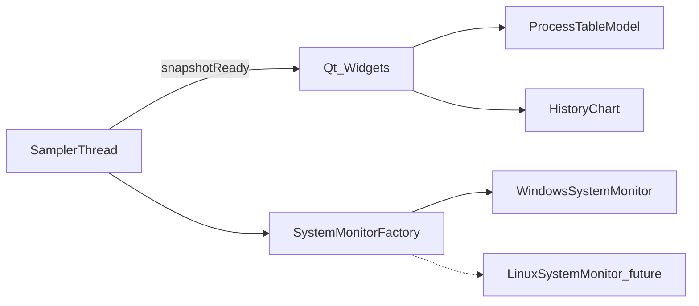

# Windows 任务管理器开发计划

用 CMake 与 Qt 6 Widgets 从零实现一个 Windows 任务管理器核心版：进程列表（CPU、内存、磁盘、网络）、结束进程、性能曲线。采集层通过接口隔离，当前只实现 Windows，完成后推送到 `https://github.com/Kuwumo/TaskManager.git`。

本文记录开发计划与任务拆分。实现见仓库源码和 README。

## 现状

- 工作目录 `D:\Workspace\TaskManager` 已包含可编译的 Qt / CMake 工程。任务 T0.1 至 T5.2 的实现以源码和 README 为准。
- 已具备：CMake 3.31、Visual Studio 2022 Professional、Windows SDK、Git 2.55。
- Qt 6.11.2 的 MSVC 2022 64-bit 套件可用，前缀为 `C:/Qt/6.11.2/msvc2022_64`。
- 未具备：GitHub CLI `gh`。推送使用 `git push`。
- 第一版只采集 Windows 数据。目录和工厂按平台拆开，便于以后加 Linux（`/proc`）和 macOS。

## 目标功能

- **进程**：名称、PID、CPU、内存（工作集）、磁盘读写速率、网络收发速率。可排序，可按名称过滤。
- **结束任务**：选中进程后确认，再调用 `TerminateProcess`。权限不足时给出明确提示。
- **性能**：CPU（总占用和每个逻辑核心）、内存、磁盘、网络各保留约 60 秒曲线和当前数值。
- **刷新**：默认 1 秒，可暂停。采样在后台线程，界面线程只接收快照。

界面使用中文。顶部为「进程 / 性能」两个页，进程页提供「结束任务」。

## 架构



- 界面只依赖 `src/core/ISystemMonitor.h`，不直接调用 Win32。
- `src/core/SystemMonitorFactory.cpp` 在 `WIN32` 下选择 Windows 实现。Linux / macOS 源文件放在 `src/platform/`，本版不加入编译。
- 只依赖 `Qt6::Widgets`。曲线用自绘 `QWidget`，不引入 Qt Charts。

### 指标来源

| 指标 | 范围 | Windows 来源 | 说明 |
| --- | --- | --- | --- |
| CPU | 每进程 | `GetProcessTimes` 与 `GetSystemTimes` 的增量比 | 整机 0–100%，与当前任务管理器一致 |
| 内存 | 每进程 | `GetProcessMemoryInfo` 工作集 | |
| 磁盘 | 每进程 | `GetProcessIoCounters` 读写字节增量 | 这是进程 I/O，不是任务管理器的 ETW 磁盘计数。列名仍为「磁盘」，README 写明差异 |
| 网络 | 每进程 | ETW `Microsoft-Windows-Kernel-Network`，按 PID 累计收发字节 | 会话打不开时该列显示「—」，状态栏说明需要更高权限 |
| CPU | 整机 | PDH `\Processor(*)\% Processor Time` | 总占用和每个逻辑核心 |
| 内存 | 整机 | `GlobalMemoryStatusEx` | |
| 磁盘 | 整机 | PDH `\PhysicalDisk(_Total)` | |
| 网络 | 整机 | PDH `\Network Interface(*)` | 不依赖 ETW |

打不开句柄的受保护进程仍显示名称和 PID，指标显示为不可用。

### 快照类型

- `ProcessSnapshot`：pid、名称、CPU 百分比、工作集字节、磁盘字节/秒、网络字节/秒、网络是否可用。
- `SystemSnapshot`：CPU（总量与每核）、内存（总量与已用）、磁盘（活动时间或吞吐）、网络（发送/接收）、进程列表。
- 界面侧用 60 点环形缓冲保存历史，供曲线绘制。

## 工程结构

```text
CMakeLists.txt
CMakePresets.json
.gitignore
README.md
docs/开发计划.md
src/main.cpp
src/core/Types.h
src/core/ISystemMonitor.h
src/core/SystemMonitorFactory.cpp
src/core/SamplerThread.h
src/core/SamplerThread.cpp
src/model/ProcessTableModel.h
src/model/ProcessTableModel.cpp
src/ui/MainWindow.h
src/ui/MainWindow.cpp
src/ui/ProcessPage.h
src/ui/ProcessPage.cpp
src/ui/PerformancePage.h
src/ui/PerformancePage.cpp
src/ui/HistoryChart.h
src/ui/HistoryChart.cpp
src/platform/windows/WindowsSystemMonitor.h
src/platform/windows/WindowsSystemMonitor.cpp
```

- `CMakeLists.txt`：C++17，`find_package(Qt6 REQUIRED COMPONENTS Widgets)`，生成 WIN32 可执行文件。Windows 链接 `Psapi`、`Pdh`、`Tdh`、`Advapi32`。
- `CMakePresets.json`：生成器 `Visual Studio 17 2022`、平台 `x64`，`CMAKE_PREFIX_PATH` 指向本机 Qt 的 `msvc2022_64`。
- `.gitignore`：忽略 `build/`、`.vs/`、CMake 用户缓存。

构建命令：

```powershell
cmake --preset windows-msvc
cmake --build --preset windows-msvc --config Release
```

运行 `build/Release/TaskManager.exe`。这是桌面程序，用实际启动对照系统任务管理器验证。

## 任务拆分

任务按依赖顺序排列。下一项开始前，它列出的前置任务应已完成。状态在动手实现前全部为「未开始」。

### 阶段 0：环境

#### T0.1 补齐 Qt 6.11.2 的 MSVC 基础组件

- 状态：已完成（2026-09-28 复核）。
- 内容：用 `C:\Qt\MaintenanceTool.exe` 在已有 Qt 6.11.2 上追加组件「MSVC 2022 64-bit」（Qt 本体，含 Core、Gui、Widgets）。
- 产出：前缀路径 `C:/Qt/6.11.2/msvc2022_64`。
- 验收：该路径下存在 `bin/qmake.exe`、`lib/cmake/Qt6/Qt6Config.cmake`、`lib/cmake/Qt6Widgets/Qt6WidgetsConfig.cmake`，以及 `Qt6Core.dll`、`Qt6Gui.dll`、`Qt6Widgets.dll`。均已存在。
- 前置：无。

#### T0.2 记录本机前缀

- 内容：把 `C:/Qt/6.11.2/msvc2022_64` 写入 `CMakePresets.json` 的 `CMAKE_PREFIX_PATH`。
- 验收：路径与本机套件一致，使用正斜杠。
- 前置：T0.1。可与 T1.2 一起完成。

### 阶段 1：工程骨架

#### T1.1 CMake 工程

- 内容：建立 `CMakeLists.txt`，C++17，查找 Qt6 Widgets，声明可执行目标 `TaskManager`。Windows 上链接 `Psapi`、`Pdh`、`Tdh`、`Advapi32`。平台源文件用 `if(WIN32)` 加入。
- 验收：在 Qt 已配置时，`cmake --preset windows-msvc` 能完成配置。
- 前置：T0.1。

#### T1.2 CMake 预设

- 内容：添加 `CMakePresets.json`，生成器为 Visual Studio 17 2022，架构 x64，构建目录 `build`。
- 验收：`cmake --preset windows-msvc` 能选中该预设。
- 前置：T0.2、T1.1。

#### T1.3 忽略构建产物

- 内容：添加 `.gitignore`，忽略 `build/`、`.vs/`、`CMakeUserPresets.json`、`*.user`。
- 验收：配置并编译后，`git status` 不出现构建目录。
- 前置：无。可与 T1.1 并行。

#### T1.4 空窗口可启动

- 内容：`src/main.cpp` 创建 `QApplication` 和一个临时主窗口，确认 Qt 链接正确。后续由 T4.1 替换为正式主窗口。
- 验收：Release 可执行文件能打开并关闭一个窗口。
- 前置：T1.2。

### 阶段 2：采集接口

#### T2.1 快照类型

- 内容：在 `src/core/Types.h` 定义 `ProcessSnapshot` 与 `SystemSnapshot`，只使用 Qt 基础类型，不包含 Win32 头文件。
- 验收：界面和平台实现都能包含该头文件，且不因此引入 `windows.h`。
- 前置：T1.1。

#### T2.2 监控接口

- 内容：`ISystemMonitor` 提供采样整机与进程快照，以及按 PID 结束进程。结束失败时返回错误文本。
- 验收：接口不暴露 Win32 类型；调用方能区分成功、权限不足和其他失败。
- 前置：T2.1。

#### T2.3 平台工厂

- 内容：`SystemMonitorFactory` 在 Windows 上返回 Windows 实现。其他平台返回空指针或明确的「未实现」结果，本版不编译对应源文件。
- 验收：Windows 构建能创建监控对象；非 Windows 分支在 CMake 中被排除。
- 前置：T2.2。Windows 类的真实行为在阶段 3 完成，本任务可以先返回能编译的占位实现。

#### T2.4 采样线程

- 内容：`SamplerThread` 以 1 秒为周期在后台取快照，用信号把副本送到界面线程。支持暂停和恢复。采样失败不退出线程。
- 验收：界面线程不调用 `OpenProcess`、PDH 或 ETW；暂停后不再发出新快照，恢复后继续。
- 前置：T2.3。

### 阶段 3：Windows 采集

#### T3.1 进程枚举、CPU 与内存

- 内容：用 Toolhelp 枚举进程。用 `GetProcessTimes` 相对 `GetSystemTimes` 计算 CPU。用 `GetProcessMemoryInfo` 读取工作集。进程退出或 PID 复用时丢弃上一拍数据，避免把增量算到新进程上。
- 验收：名称、PID、CPU、内存能刷新；受保护进程仍出现在列表中，打不开句柄时指标为不可用。CPU 量级与系统任务管理器同一次观察大体一致。
- 前置：T2.3。

#### T3.2 每进程磁盘速率

- 内容：用 `GetProcessIoCounters` 的读写字节差除以采样间隔，得到字节/秒。
- 验收：对一个持续读写文件的进程，磁盘列大于 0，空闲进程接近 0。
- 前置：T3.1。

#### T3.3 整机性能计数

- 内容：用 PDH 采集每逻辑核心 CPU、物理磁盘和网络接口吞吐，用 `GlobalMemoryStatusEx` 采集物理内存。多块网卡的收发分别相加，或选当前有流量的活动适配器并在界面标出名称。计数器查询失败时保留上一拍并记录错误，不崩溃。
- 验收：四类整机数值随采样更新，CPU 核心数与本机逻辑处理器数量一致。
- 前置：T2.3。可与 T3.1 并行。

#### T3.4 每进程网络速率

- 内容：后台开启 ETW 实时会话，订阅内核网络事件，按 PID 累计发送和接收字节，再换算为字节/秒。会话无法创建时，进程网络列标记为不可用，整机网络曲线仍由 T3.3 提供。
- 验收：权限足够时，产生网络流量的进程网络列大于 0。权限不足时列显示「—」，状态栏有说明，程序继续运行。
- 前置：T3.1。

#### T3.5 结束进程

- 内容：按 PID 打开进程并调用 `TerminateProcess`。拒绝结束 PID 0、PID 4 和当前进程。把拒绝访问和其他错误转换成可显示的文本。
- 验收：能结束一个普通测试进程（如记事本）。结束系统关键进程或无权限进程时程序不崩溃，并返回失败原因。
- 前置：T2.2。

### 阶段 4：界面

#### T4.1 主窗口

- 内容：正式 `MainWindow`，中文标题，顶部「进程」「性能」两页，状态栏显示采样状态和网络权限提示。持有 `SamplerThread`，把快照分发给两个页。
- 验收：启动后两页都能切换；关闭窗口时采样线程先停止再退出。
- 前置：T1.4、T2.4。

#### T4.2 进程表模型

- 内容：`ProcessTableModel` 列名为名称、PID、CPU、内存、磁盘、网络。CPU 用百分比，内存和速率用合适单位。支持按列排序，默认按 CPU 降序。不可用的数值显示为「—」。
- 验收：快照更新后选中行不乱跳；排序和刷新同时发生时表格仍可用。
- 前置：T2.1、T4.1。

#### T4.3 过滤与结束任务

- 内容：名称过滤框。「结束任务」对当前选中进程弹出确认框，确认后调用监控接口。无选择、结束自身或失败时给出提示。
- 验收：过滤只影响显示。确认后目标进程消失；取消后进程仍在。失败提示包含接口返回的原因。
- 前置：T3.5、T4.2。

#### T4.4 曲线控件

- 内容：自绘 `HistoryChart`，保存固定长度历史（约 60 秒），绘制折线和当前值。支持单序列（内存、磁盘、网络）和多序列（每个 CPU 核心）。
- 验收：窗口缩放后曲线仍完整；暂停采样时曲线停止前进，恢复后继续。
- 前置：T4.1。

#### T4.5 性能页

- 内容：左侧 CPU、内存、磁盘、网络四项，右侧对应曲线和当前数值（总量、已用、收发速率等）。数据来自整机快照，不从进程表累加。
- 验收：四项都能切换，数值约每秒更新，与系统任务管理器的量级大体一致。
- 前置：T3.3、T4.4。

### 阶段 5：说明、验证与上传

#### T5.1 README

- 内容：写明依赖、Qt 路径、配置、编译、运行，以及每进程磁盘是 I/O 计数、每进程网络依赖 ETW 权限。
- 验收：按 README 能在一台已装 VS 2022 与 Qt 6 的 Windows 机器上完成配置和编译。
- 前置：T1.1、T1.2、T3.2、T3.4。

#### T5.2 本机验证

- 内容：编译 Release 并启动。对照系统任务管理器核对进程 CPU 与内存量级。结束记事本。观察四条性能曲线约 1 秒刷新一次。检查暂停、过滤、权限不足时的网络列。
- 验收：上述路径都实际走过；发现的问题先修再继续上传。
- 前置：T4.3、T4.5、T5.1。

#### T5.3 提交并推送

- 内容：若目录还不是 Git 仓库则初始化。远程设为 `https://github.com/Kuwumo/TaskManager.git`。提交源码、CMake、`.gitignore`、README 和 `docs/`。不提交 `build/`。执行 `git push -u origin main`。
- 验收：远程仓库能看到上述文件，看不到构建产物。
- 前置：T5.2。
- 说明：本机没有 `gh`。远程仓库不存在或推送需要登录时，先在 GitHub 建好空仓库，或用 Git 凭据完成认证后再推。

## 建议实施顺序

1. T0.1、T1.3
2. T0.2、T1.1、T1.2、T1.4
3. T2.1、T2.2、T2.3、T2.4
4. T3.1、T3.2、T3.3、T3.5，随后 T3.4
5. T4.1、T4.2、T4.4、T4.3、T4.5
6. T5.1、T5.2、T5.3

T3.4（ETW）是采集里风险最高的一项。整机网络曲线不依赖它，所以放在进程 CPU、内存、磁盘和整机 PDH 之后。

## 本版不做

- Linux 与 macOS 的真实采集。
- GPU、应用历史、启动项、服务、用户会话、优先级和处理器相关性。
- 每进程磁盘的 ETW 精确计数。
- 安装包、自动更新和多语言切换。
